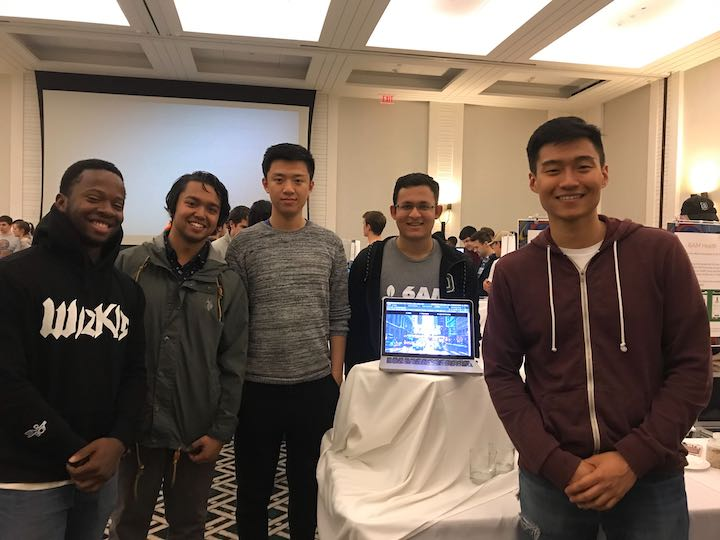

# Busking API (Backend)

A decentralized platform that empowers street performers to publicize their musical events. This democratizes information so that more people can support up-and-coming artists in their region.

## Tech Stack
- React.js, Redux, Node.js/Express, MongoDB.

## Architecture
### API's used
- **Google Maps Javascript API**
	- We used the Google Maps Javascript API to display events on a map
- **Geolocation API**
	- We used the Geolocation API to determine the user's location and sort events based on proximity to user.
- **Google Directions API**
	- We used the Google Directions API to display directions from the user's location to an event. These directions were rendered on the map and as step by step instructions.
- **Google Geocoding API**
	- We used the Google Geocoding API to convert places to latitude and longitude. This allowed for a better user experience as users did not have to enter the longitude and latitude of their event location.
- **Google Places API**
	- We used the Google Places API to convert latitude and longitude to actual addresses. This was used in the event sorting algorithm to display events closer to the user first. 
- **Stripe Connects API**
	- we used the Stripe Connects API to build the payments infrastructure for our app. 
	- From a user flow perspective, users can **directly** receive tips from the public by either linking their own Stripe account into our platform or going through the Stripe Connect OAuth flow to create their Stripe accounts. Then, they will be **redirected** to our landing page to see the full list of events.
	- **LINKING STRIPE:** A user can go to my profile and click **Stripe Connect**, which will re-directed them to Stripe Oauth flow. For testing purposes, you can just sign in to stripe and click `Skip the account form`, as you don't want to spend `~30 mins` to fill up a form. Clicking `Skip the account form` will redirect you back to the home page!
	- If a user doesn't have Stripe account linked to their user profile, then Busker receives the tip on the Busker dashboard and can reconcile the balance with the perfomer afterwards.
- **AMAZON S3**
	- we enabled amazon S3 so that users can seemlessly upload their images when creating events. This makes more sense from a user-flow perspective than having them upload a link.

## Setup

Clone both the front-end and back-end and run `yarn` to install all the project dependencies. Make sure you have a mongo process running in another terminal in the background with `mongod &`. Then run `yarn start` in the front-end, `yarn-dev` in the backend, to load the project locally. 
Make sure you have the `.env` file placed in the **root** directory of the project so that you have access to the required environment variables for the backend to work. Ma

## Deployment

We deployed the both the front-end and back-end using **Heruko**. See our deployed project at [Busker](https://busking.surge.sh/)

## Authors

Xingran Zhuang '19, Rafi Khaled '20 , Tianxing Dai '20, Chikezie Onungwa '20, Yakoob Khan '21

## Acknowledgments
We have to thank Tim for teaching us web-dev this term! Hat's off to all the hard work of the TA's for making CS 52 such an amazing and supportive class. It helped us make this project from the ground-up a success and something that we are proud to display to others after this class.
